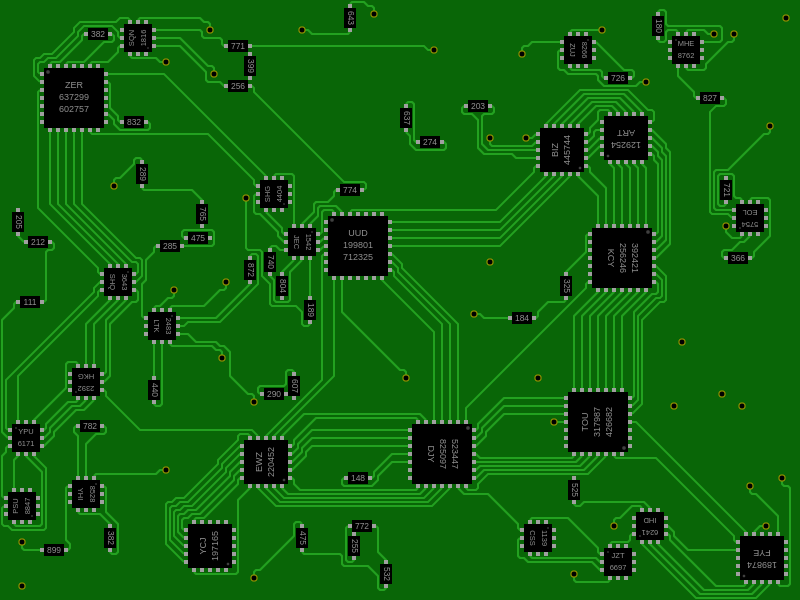

## Procedural electronic schematic generation

The goal of this project was to create, quickly (few evenings) and using javascript, a small program
able to generate an electronic schematic, that looks real (but makes no sense).

Here is basically how it works:
- Chips are placed randomly on the page with their pins
- Pins are linked using a rudimentary A* algorithm
- Randomly, elements such as resistors or diodes are placed on the wire
- Single elements such as GND are placed randomly on the page and linked to pins

## Examples

